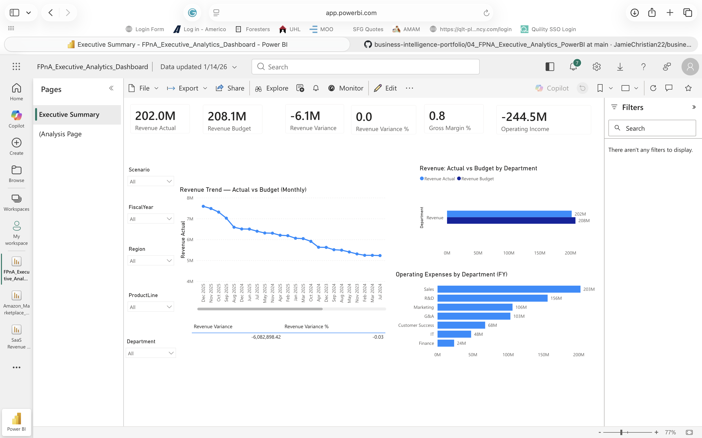

# 💰 FP&A Executive Analytics Dashboard (Power BI)

🚀 This project delivers a **financial planning & analysis (FP&A) executive dashboard** designed to help leadership monitor financial performance, control costs, and drive strategic decision-making.

---

## 📊 Dashboard Preview

---

## 🎯 Business Problem

Leadership lacks a centralized view of financial performance across departments, making it difficult to:

* Track budget vs actual performance
* Identify cost inefficiencies
* Monitor profitability and financial health
* Make timely, data-driven decisions

Finance teams need a dashboard that provides **real-time visibility into key financial metrics and trends**.

---

## 🧠 Key Questions Answered

* Are we over or under budget?
* Which departments are driving costs?
* How is profitability trending over time?
* Where can we improve financial efficiency?

---

## 🔍 Key Insights

* **Marketing consistently exceeds budget**, indicating cost control issues
* Certain departments operate **below budget**, suggesting resource underutilization
* Variance trends highlight **gaps in forecasting accuracy**
* Profitability is impacted by **cost structure rather than revenue decline**

---

## 💰 Business Impact

Improving budget control and cost allocation could:

👉 Reduce operational expenses by **5–10% annually**
👉 Improve forecasting accuracy and financial planning reliability
👉 Enable more strategic resource allocation across departments

---

## 🧠 Advanced Analysis

### 📊 Budget vs Actual Analysis

* Variance tracking by department
* Identification of over/under-spending trends

### 💸 Cost Segmentation

* Department-level expense breakdown
* Identification of high-cost drivers

### 📈 Financial Trend Analysis

* Revenue, profit, and expense trends over time
* Performance tracking against targets

---

## 🧰 Tools & Technologies

* **Power BI** → Executive dashboard development
* **SQL** → Data aggregation & financial analysis
* **Excel** → Financial data preparation
* **Python (Pandas)** → KPI validation

---

## 🧩 Data Model

This project uses a finance-focused structure:

* **Fact Table:** Financials (Revenue, Expenses, Profit)
* **Dimensions:**

  * Department
  * Date
  * Cost Category
  * Budget vs Actual

---

## 📈 KPIs Tracked

* Revenue
* Expenses
* Profit
* Budget vs Actual Variance
* Profit Margin
* Cost by Department

---

## 🚀 Why This Project Matters

This project demonstrates the ability to:

* Analyze financial performance at an executive level
* Identify cost inefficiencies and optimization opportunities
* Support strategic planning and forecasting
* Translate financial data into actionable business insights

---

## 🏁 Final Takeaway

> This dashboard is not just a financial report — it is a **strategic decision-making system** that enables leadership to control costs, improve profitability, and drive business performance.
