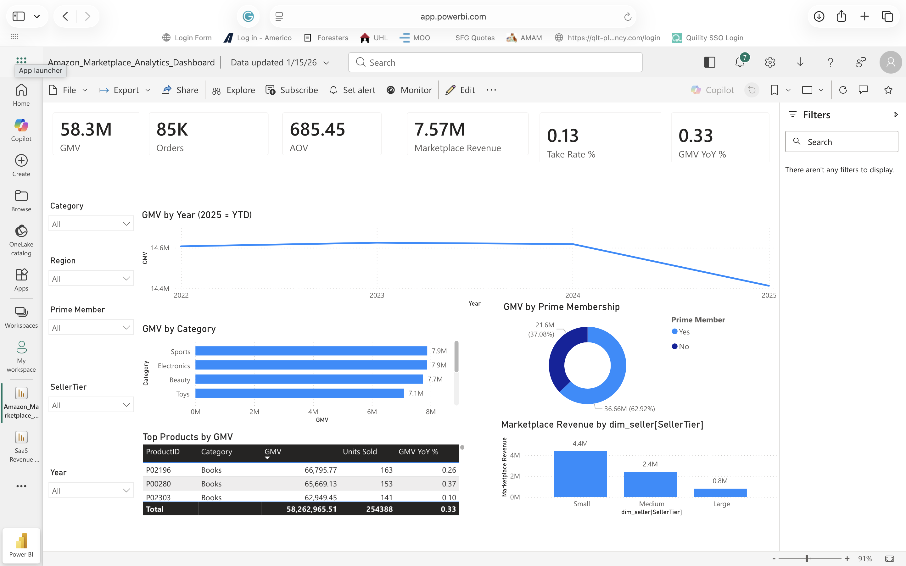

# 📊 Business Intelligence Portfolio — Jamie Christian

🚀 I build **decision systems, not just dashboards** — transforming raw data into actionable insights that drive revenue, optimize performance, and improve business outcomes.

---

## 💼 About This Portfolio

This portfolio demonstrates **end-to-end Business Intelligence workflows** across real-world business scenarios:

**Raw Data → Data Modeling → SQL Analysis → BI Dashboards → Insights → Executive Decisions**

Each project is built to reflect how BI is used in real organizations — not just to visualize data, but to **solve business problems and influence strategy**.

---

## 🧠 What I Bring

* 📊 Data-driven decision making
* 📈 KPI design & performance tracking
* 🧮 Advanced SQL (CTEs, window functions, cohort & funnel analysis)
* 📉 Dashboard development (Power BI, Tableau)
* 🧩 Data modeling (star schema, fact/dimension tables)
* 💡 Translating data into business impact

---

## 🧰 Tech Stack

* **BI Tools:** Power BI, Tableau
* **Data:** SQL, Excel
* **Programming:** Python (Pandas)
* **Techniques:**

  * Funnel Analysis
  * Cohort Analysis
  * Customer Segmentation
  * KPI Frameworks
  * Financial & Operational Analytics

---

# 📂 Featured Projects

---

## 📊 1. Sales Performance Analytics (Power BI)

### 🎯 Business Problem

Sales performance varies across regions with limited visibility into revenue drivers and conversion efficiency.

### 🔍 Key Insights

* West region drives the largest share of revenue due to higher deal sizes
* Conversion rates are significantly lower in underperforming regions
* Enterprise channel outperforms SMB in revenue efficiency

### 💰 Business Impact

Improving conversion rates by **3–5%** could generate approximately **$200K–$350K in additional quarterly revenue**

### 🧠 Advanced Analysis

* Revenue segmentation by region
* Conversion funnel (Leads → Deals Won)
* Performance ranking using window functions

---

## 🛒 2. Ecommerce Product Analytics (Power BI)

### 🎯 Business Problem

The ecommerce platform needs to improve conversion rates and increase average order value (AOV).

### 🔍 Key Insights

* Mobile users convert at a lower rate than desktop users
* Email traffic generates the highest AOV
* High bounce rates indicate friction in the user journey

### 💰 Business Impact

Optimizing mobile conversion could increase revenue by **$150K–$300K per quarter**

### 🧠 Advanced Analysis

* Funnel analysis (Sessions → Orders)
* Traffic source performance segmentation
* Device-based conversion breakdown

---

## 🛍️ 3. Amazon Marketplace Analytics (Power BI)

### 🎯 Business Problem

Marketplace revenue is highly concentrated among top sellers, creating operational risk.

### 🔍 Key Insights

* Top sellers contribute the majority of total GMV
* FBA sellers outperform FBM in fulfillment efficiency
* Return rates vary significantly by category

### 💰 Business Impact

Reducing seller concentration risk could stabilize **millions in annual revenue exposure**

### 🧠 Advanced Analysis

* Seller segmentation (Top vs Mid vs Long-tail)
* Pareto (80/20) revenue analysis
* Fulfillment performance comparison

---

## 💰 4. FP&A Executive Analytics (Power BI)

### 🎯 Business Problem

Leadership needs visibility into budget vs actual performance and cost drivers.

### 🔍 Key Insights

* Marketing consistently exceeds budget targets
* Certain departments operate below allocated spend
* Variance trends highlight inefficiencies in planning

### 💰 Business Impact

Improved budget control could reduce costs by **5–10% annually**

### 🧠 Advanced Analysis

* Budget vs Actual variance analysis
* Department-level cost segmentation
* Financial trend forecasting

---

## 📈 5. SaaS Product Analytics — StreamFlow (Tableau)

.png)

### 🎯 Business Problem

High early churn is limiting MRR growth and long-term customer value.

### 🔍 Key Insights

* Most churn occurs within the first 30 days
* Low engagement correlates with higher churn
* Active users show significantly higher retention

### 💰 Business Impact

Reducing early churn by **5%** could significantly increase lifetime value and recurring revenue

### 🧠 Advanced Analysis

* Cohort retention analysis
* User engagement segmentation
* Churn lifecycle modeling

---

# 🧪 Advanced Analytics Capabilities

Across projects, I apply:

* 📊 **Cohort Analysis** → Understanding retention over time
* 🔁 **Funnel Analysis** → Identifying drop-off points in user journeys
* 🧩 **Segmentation** → Targeting high-value customers and opportunities
* 📈 **Trend Analysis** → Tracking performance over time
* ⚙️ **KPI Frameworks** → Defining metrics that drive decisions

---

# 🚀 Why This Portfolio Stands Out

This is not just a collection of dashboards.

It demonstrates the ability to:

* Solve real business problems
* Communicate insights clearly to stakeholders
* Connect data to revenue and performance outcomes
* Build complete BI solutions from data to decision

---

# 📬 Let’s Connect

* 🔗 LinkedIn: https://linkedin.com/in/your-link
* 💻 GitHub: https://github.com/JamieChristian22
* 📧 Email: [Jamiechristian331@gmail.com](mailto:Jamiechristian331@gmail.com)

---

## 🏁 Final Note

This portfolio reflects how I approach Business Intelligence:

> **Not just analyzing data — but driving decisions that matter.**
