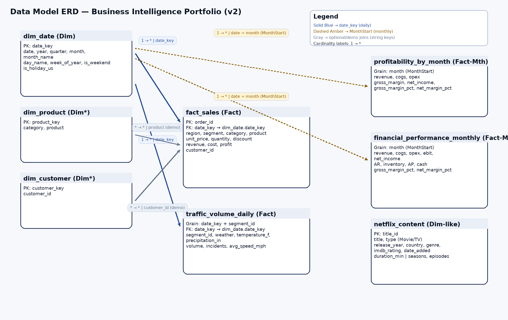
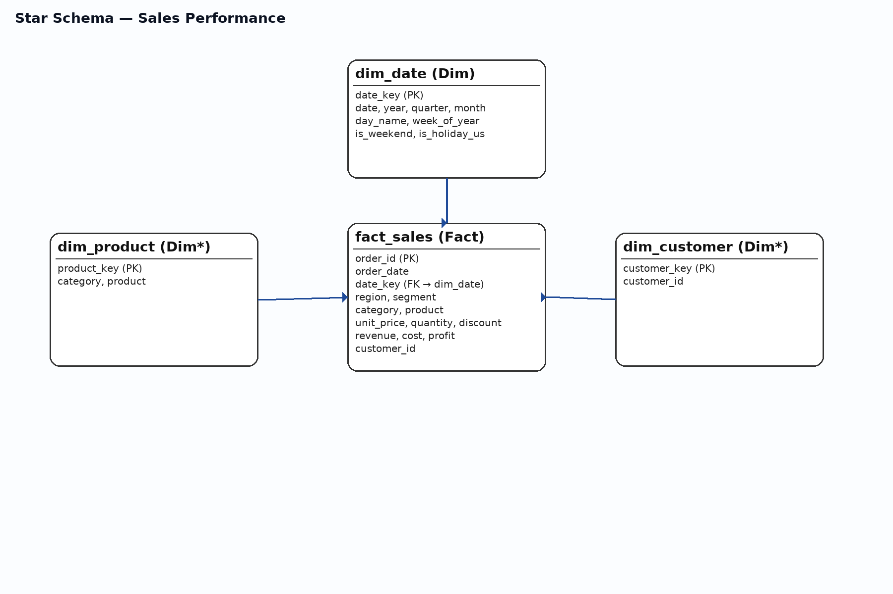

---

## 📊 Visual References

### 🔹 Entity Relationship Diagram (ERD)

Shows all fact and dimension tables, relationships, and grain definitions.

### 🔹 Star Schema — Sales Performance

Demonstrates the core Sales fact table connected to key dimensions (Date, Product, Customer).

---

## 🧮 Related Files

| File | Description |
|------|--------------|
| [`../02_SQL_Queries/`](../02_SQL_Queries/) | Source SQL transformations & data quality checks |
| [`../03_DAX_Measures/DAX_Measures.md`](../03_DAX_Measures/DAX_Measures.md) | Centralized DAX measures |
| [`../data/`](../data/) | Clean CSV datasets used in the model |
| [`../05_Case_Studies/`](../05_Case_Studies/) | Business insights & interpretations |

---

## 🧠 BI Modeling Summary

| Theme | Focus |
|--------|--------|
| **Modeling Approach** | Kimball Star Schema |
| **Tools Used** | Power BI, SQL, Tableau |
| **Primary Date Table** | `dim_date` (marked as official Date Table) |
| **Fact Tables** | Sales, Profitability, Finance, Traffic |
| **Dimensions** | Date, Product, Customer, Content |
| **Time Intelligence** | MTD, QTD, YTD, YOY, Rolling 12-months |
| **Governance** | KPI Data Dictionary + DAX library |

---

### 🧩 Author
**Jamie Christian**  
Certified Data Analyst | BI Developer | Systems Analyst  
📊 Building data models that translate numbers into strategy.  
📎 [linkedin.com/in/jamiechristiananalytics](https://linkedin.com/in/jamiechristiananalytics)

---

